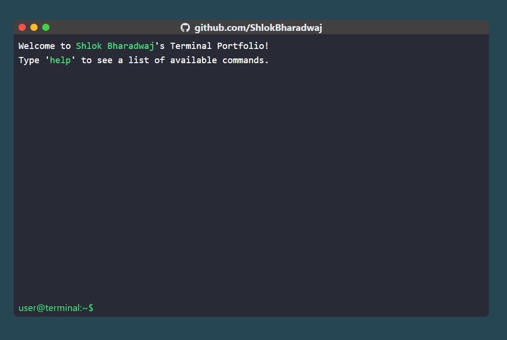

# Terminal Portfolio

This is my personal portfolio website showcasing my projects and skills. It is inspired by several fantastic portfolio websites. Feel free to explore and get to know more about me!

You can also visit the hosted portfolio<a href="https://shlokbharadwaj.github.io/portfolio/" target="_blank"> here</a>.


## Technologies Used

- HTML
- CSS
- JavaScript
- React
- Tailwind CSS

## Getting Started

1. Clone the repository: 
```
git clone https://github.com/ShlokBharadwaj/portfolio
```
2. Navigate to the project directory: 
```
cd portfolio
```
3. Install the dependencies: 
```
npm install
```
4. Start the development server: 
```
npm start
```
5. Open your browser and visit: 
```
http://localhost:3000
```
## Contributing

Contributions are welcome! If you have any suggestions or improvements, feel free to open an issue or submit a pull request.

## Inspiration

This project was inspired by the following portfolio websites:

- <a href="https://fkcodes.com/" target="_blank">FKCodes</a> - The clean and minimalist design.
- <a href="https://ashleighsimonelli.co.uk/" target="_blank">Ashleigh Simonelli</a> - The creative and visually appealing layout.
- <a href="https://www.kavin.me/" target="_blank">Kavin</a> - The innovative use of animation and transitions.
- <a href="https://liveterm-2ox2y7g8c-cveinnt.vercel.app/" target="_blank">LiveTerm</a> - The terminal-style layout and interactive typing effect.
- <a href="https://heberleonard2.github.io/terminal-style-portfolio-page/" target="_blank">Heber Leonard</a> - The terminal-style design and command execution.
- <a href="https://loakeshbachhu.github.io/" target="_blank">Loakesh Bachhu</a> - The interactive terminal-like interface.
- <a href="https://evilprince2009.netlify.app/" target="_blank">Evil Prince</a> - The unique and captivating design elements.

## License

This project is licensed under the [MIT License](LICENSE).
